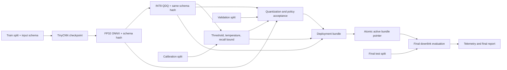

# PhiSat-2 Trustworthy Onboard AI


[](https://github.com/sylvesterkaczmarek/phisat2-trustworthy-onboard-ai/actions/workflows/ci.yml)


[](https://doi.org/10.5281/zenodo.17567181)

Research demonstrator for deterministic Earth-observation tile triage, PyTorch to ONNX deployment, static INT8 quantization, conservative downlink fallback, telemetry, and coherent model-policy-preprocessing deployment rollback. The workflow is inspired by onboard EO processing such as PhiSat-2, but it is independent software and is not ESA or PhiSat-2 flight code.

## At a glance



The design uses four independent data roles and a versioned input/preprocessing contract. A deployable configuration is an immutable bundle that cryptographically binds the ONNX model to its band ordering, preprocessing schema, calibration policy, and validation evidence.

## What is implemented

- deterministic synthetic EO data generation with independent `train`, `calib`, `validation`, and final `test` splits
- versioned EO input schema with ordered band metadata, optional wavelength metadata, layout, dtype/range, normalization, nodata policy, and preprocessing version
- canonical input-contract SHA-256 propagated through dataset, checkpoint, ONNX, calibration, validation, telemetry, and deployment bundle
- arbitrary multispectral band counts through NumPy tile stacks
- deterministic TinyCNN training with architecture and input-contract metadata stored in the checkpoint
- PyTorch to FP32 ONNX export with ONNX validation, numerical equivalence check, model metadata binding, and schema sidecar
- static QDQ INT8 quantization that preserves and verifies the same input contract
- validation-only FP32 versus INT8 gates for accuracy, event recall/FNR, F1, PR-AUC, score drift, argmax agreement, and calibrated retain/discard decisions
- calibrated event threshold with empirical recall and a one-sided exact Clopper-Pearson lower confidence bound
- optional acceptance gate on the calibration recall lower bound
- conservative fallback that downlinks low-confidence tiles and inference failures
- strict channel handling with no implicit grayscale replication, alpha addition, or channel dropping
- deterministic rejection of ambiguous legacy CHW/HWC NumPy layouts
- deliberate rejection of TIFF/GeoTIFF by the generic loader rather than unsafe 8-bit conversion
- content-addressed immutable deployment bundles with coherent rollback
- CI that runs the full multispectral pipeline

## Decision policy

A tile is retained when it is predicted to contain the target event, when confidence is below the configured minimum, or when preprocessing/inference fails. Only confidently classified background data are discarded.

See [docs/assurance.md](docs/assurance.md) for the assurance model and limitations.

## Quick start

```bash
git clone https://github.com/sylvesterkaczmarek/phisat2-trustworthy-onboard-ai.git
cd phisat2-trustworthy-onboard-ai/examples/phi2-eo-tile-filter
python -m venv .venv
source .venv/bin/activate
python -m pip install -e ".[dev]"
python scripts/run_demo.py --n 200 --bands 3 --size 64 --epochs 3 --seed 0
```

A multispectral run uses the same pipeline:

```bash
python scripts/run_demo.py --n 160 --bands 7 --size 32 --epochs 2 --seed 0 --output-root /tmp/phi2-7band
```

The generated dataset contains `input_schema.json`. For the synthetic seven-band example, its bands are deliberately named `band_01` through `band_07`. Those identifiers are generic and do not claim to reproduce PhiSat-2 spectral response or band definitions.

## Generated outputs

A complete run produces:

```text
tiles/input_schema.json
calibration.json
logs/test.jsonl
logs/downlink.jsonl
models/tinycnn_fp32.onnx.input_schema.json
models/tinycnn_int8.onnx.input_schema.json
models/candidate_bundle/
models/bundles/<bundle_id>/
models/deployment_state.json
reports/model_validation.json
reports/metrics.json
reports/summary.md
```

Each stored bundle contains `model.onnx`, `policy.json`, `input_schema.json`, `validation.json`, and `bundle.json`. The bundle records both file hashes and a canonical semantic input-contract hash.

## Validation gates

The pipeline fails rather than silently continuing when:

- a dataset manifest and input schema disagree
- checkpoint architecture and input-contract metadata disagree
- ONNX model metadata does not match its schema sidecar
- FP32 and INT8 models use different preprocessing contracts or band ordering
- calibration/validation/test data declare a different input schema from the model
- a calibration policy has a different model or input-contract hash
- validation-split INT8 accuracy, event recall/FNR, PR-AUC, score drift, or calibrated retention behaviour regresses beyond configured limits
- an optional calibration recall lower-bound requirement is not met
- any bundle component or semantic input-contract binding is inconsistent

The final test split is not used to decide whether the candidate is accepted.

## Input and preprocessing contract

`input_schema.json` describes more than `(bands, height, width)`. It can represent:

- ordered band identifiers and human-readable names
- optional centre wavelengths or wavelength ranges
- source layout and model layout
- tile height and width
- source dtype and expected radiometric range
- model dtype
- normalization procedure and version
- nodata policy
- preprocessing implementation and version
- resize behaviour

Changing any of those fields changes the canonical contract hash. Runtime checks that the ONNX metadata, schema sidecar, calibration policy, validation evidence, deployment bundle, and data-root schema all agree before model input is accepted.

For NumPy data, an explicit schema removes CHW/HWC guessing. The legacy shape-based utility path rejects arrays that are plausible in both layouts.

PNG and JPEG are handled only with their existing `L`, `RGB`, or `RGBA` channel structure. The loader does not call PIL conversion to manufacture or discard channels. TIFF and GeoTIFF are deliberately rejected because scientific TIFF frequently carries high-bit-depth, multiband, geospatial, scale/offset and nodata semantics that require an EO-aware ingest path.

See [examples/phi2-eo-tile-filter/data/README.md](examples/phi2-eo-tile-filter/data/README.md) for a seven-band schema example.

## Deployment bundle handling

Build a candidate only after calibration and validation have succeeded:

```bash
python ../../assurance/model_store.py build \
  --model models/tinycnn_int8.onnx \
  --policy calibration.json \
  --validation reports/model_validation.json \
  --out models/candidate_bundle
```

`build` automatically uses the schema sidecar bound to the ONNX model. An explicit `--input-schema` may be supplied, but it must have the same canonical hash as the model metadata, policy, and validation evidence.

Promotion and rollback operate on the complete bundle:

```bash
python ../../assurance/model_store.py promote \
  --candidate-bundle models/candidate_bundle \
  --store models/bundles \
  --state models/deployment_state.json

bash ../../assurance/rollback.sh
```

## Reproducibility

See [docs/reproducibility.md](docs/reproducibility.md). Training seeds Python, NumPy, PyTorch, and DataLoader shuffling. The dataset manifest records all four split roles, independent RNG child streams, and the input-contract hash.

## What this repository does not claim

This repository is a software and assurance demonstrator. The synthetic benchmark is deliberately simple. Input-contract hashes prove consistency between declared metadata; they do not prove that an upstream producer labelled raw sensor arrays correctly. The generic seven-band schema does not reproduce PhiSat-2 bands or radiometry.

The repository does not establish flight readiness, radiation tolerance, worst-case execution time, hardware qualification, operational EO accuracy, formal safety, or mission-level fault tolerance. Real deployment would require representative sensor data, trusted provenance, sensor-specific radiometric ingestion, hardware-in-the-loop validation, resource and thermal limits, signed update handling, fault injection, and mission-specific acceptance criteria.

## Requirements

- Python 3.11 or newer
- PyTorch 2.x
- ONNX and ONNX Runtime for export, quantization, and inference
- no accelerator is required for the CI-scale CPU demonstration

Exact dependency bounds are defined in [`examples/phi2-eo-tile-filter/pyproject.toml`](examples/phi2-eo-tile-filter/pyproject.toml).

## Cite this repository

If you use or adapt this repository, please cite:

> Kaczmarek, S. (2025). *PhiSat-2 Trustworthy Onboard AI*. Zenodo. https://doi.org/10.5281/zenodo.17567181

```bibtex
@software{Kaczmarek_2025_PhiSat2_Trustworthy_Onboard_AI,
  author    = {Sylvester Kaczmarek},
  title     = {{PhiSat-2 Trustworthy Onboard AI}},
  year      = {2025},
  publisher = {Zenodo},
  doi       = {10.5281/zenodo.17567181},
  url       = {https://doi.org/10.5281/zenodo.17567181}
}
```

## License

MIT. See [LICENSE](LICENSE).

© **Sylvester Kaczmarek** · [https://www.sylvesterkaczmarek.com](https://www.sylvesterkaczmarek.com)
