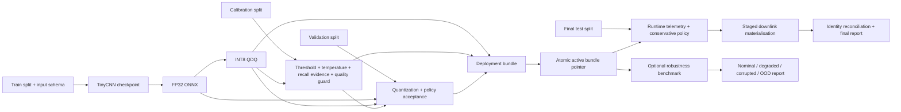

# PhiSat-2 Trustworthy Onboard AI


[](https://github.com/sylvesterkaczmarek/phisat2-trustworthy-onboard-ai/actions/workflows/ci.yml)


[](https://doi.org/10.5281/zenodo.17567181)

Research demonstrator for deterministic Earth-observation tile triage, PyTorch to ONNX deployment, static INT8 quantization, conservative downlink fallback, input-quality/OOD screening, deployment-bound telemetry, and coherent model-policy-preprocessing rollback. The workflow is inspired by onboard EO processing such as PhiSat-2, but it is independent software and is not ESA or PhiSat-2 flight code.

## At a glance



The design uses four independent lifecycle data roles and a versioned input/preprocessing contract. A deployable configuration is an immutable bundle that binds the ONNX model to its band ordering, preprocessing schema, calibrated policy, input-quality guard, and validation evidence.

## What is implemented

- deterministic synthetic EO data with independent `train`, `calib`, `validation`, and final `test` splits
- versioned EO input schema with ordered bands, optional wavelengths, layout, dtype/range, normalization, nodata policy, and preprocessing version
- canonical input-contract SHA-256 propagated through dataset, checkpoint, ONNX, calibration, validation, telemetry, and deployment bundle
- PyTorch to FP32 ONNX export with numerical verification
- static QDQ INT8 quantization with validation-only regression gates
- calibrated event threshold, deterministic temperature scaling, and one-sided exact Clopper-Pearson recall evidence
- lightweight calibrated input-quality/OOD guard using standardized per-band and image-statistics features
- conservative fallback for low confidence, quality-guard triggers, input/preprocessing failures, and inference failures
- deployment-bound telemetry carrying bundle, model, policy, schema, preprocessing, and per-input hashes
- staged filesystem writes and per-file retained-copy hash verification
- immutable content-addressed deployment bundles with coherent rollback
- process watchdog with timeout, optional heartbeat, terminate/kill escalation, and structured telemetry
- optional deterministic EO robustness benchmark with nominal, degraded, corrupted, and OOD categories
- category-specific robustness metrics and configurable prevalence-weighted source-byte estimates
- CI that exercises the full seven-band demo and a lightweight robustness smoke benchmark

## Decision policy

A tile is requested for retention when it is predicted to contain the target event, when confidence is low, when the calibrated input-quality guard marks it outside the nominal operating region, or when input observation/preprocessing/inference fails. Only a confidently classified background tile that passes the quality guard is intentionally discarded.

The input-quality guard is intentionally lightweight. It standardizes per-band means/stds plus saturation and spatial-variation features using the calibration split and computes a diagonal standardized-distance score. A trigger produces `input_quality_fallback`, retaining the tile rather than trusting a potentially confident model prediction.

This is a practical demonstrator mechanism, not a guaranteed OOD detector.

## Quick start

```bash
git clone https://github.com/sylvesterkaczmarek/phisat2-trustworthy-onboard-ai.git
cd phisat2-trustworthy-onboard-ai/examples/phi2-eo-tile-filter
python -m venv .venv
source .venv/bin/activate
python -m pip install -e ".[dev]"
python scripts/run_demo.py --n 200 --bands 3 --size 64 --epochs 3 --seed 0
```

A seven-band run:

```bash
python scripts/run_demo.py \
  --n 160 --bands 7 --size 32 --epochs 2 --seed 0 \
  --output-root /tmp/phi2-7band
```

Then evaluate the deployed bundle under deterministic stress:

```bash
python scripts/run_robustness_benchmark.py \
  --output-root /tmp/phi2-7band \
  --samples-per-category 20 \
  --seed 101 \
  --event-prevalences 0.01,0.05,0.10
```

## Robustness benchmark

The normal synthetic square-event generator remains the fast default used for training and CI. The separate robustness benchmark does not modify training, calibration, validation, or deployment state.

It evaluates four categories:

- **nominal**: the existing deterministic square-event distribution
- **degraded**: noise, illumination shifts, per-band gain/offset drift, blur, cloud-like occlusion, spatial shifts, and spectral distribution shifts
- **corrupted**: missing-band zero fill, non-finite bands, saturation, and dead-pixel/stripe patterns
- **OOD**: deterministic unknown checkerboard, sinusoidal, radial, and striped backgrounds with changed spectral structure

Perturbation magnitudes are configurable. The benchmark records every sample's condition and perturbation recipe in `benchmark_manifest.json`.

These are controlled simulation stressors, **not physically calibrated PhiSat-2 or EO sensor models**. They do not reproduce real detector noise, atmosphere, optics, clouds, compression, or spacecraft conditions.

The robustness report separates, by category:

- event retention recall
- background rejection rate
- retained fraction
- fallback rate
- input-quality guard trigger rate
- quality/preprocessing detection rate
- OOD or degradation detection rate
- inference-failure rate
- source bytes retained and reduced

## Prevalence simulation

The ordinary synthetic benchmark is deliberately balanced for testing. Many operational event-detection tasks are not.

The robustness report therefore accepts configurable event prevalences such as `0.01,0.05,0.10`. It combines those user-supplied prevalences with nominal synthetic class-conditional retention and mean source-file sizes to report:

- `expected_retained_fraction`
- `expected_source_bytes_reduction_fraction`

This is a scenario calculation, not measured mission traffic. The prevalence is not inferred from the balanced demo.

## Byte-accounting terminology

The repository reports **source-file byte reduction**, not spacecraft link bandwidth.

Current metrics use names such as:

- `source_bytes_total`
- `source_bytes_retained`
- `source_bytes_reduction_fraction` / `source_bytes_reduction_pct`
- `expected_source_bytes_reduction_fraction`

Reports explicitly state `operational_link_bandwidth_measured: false` because the demonstrator does not model packetisation, framing, FEC, retransmissions, contact geometry, protocol overhead, adaptive coding/modulation, or other link-layer behaviour.

## Generated outputs

A main run produces:

```text
tiles/input_schema.json
calibration.json
logs/test.jsonl
logs/downlink.jsonl
models/tinycnn_fp32.onnx.input_schema.json
models/tinycnn_int8.onnx.input_schema.json
models/candidate_bundle/
models/bundles/<bundle_id>/
models/deployment_state.json
reports/model_validation.json
reports/metrics.json
reports/summary.md
```

The optional robustness run additionally produces:

```text
robustness_benchmark/input_schema.json
robustness_benchmark/benchmark_manifest.json
robustness_benchmark/<category>/...
robustness_downlink/
logs/robustness_downlink.jsonl
reports/robustness_benchmark.json
```

## Validation and deployment integrity

The pipeline fails rather than silently continuing when dataset/schema metadata disagree, model/schema bindings differ, calibration belongs to another model/contract, quantization regressions exceed validation criteria, a deployment component hash is inconsistent, or runtime telemetry cannot be reconciled.

Policy schema version 5 includes the calibrated input-quality guard. The complete policy file is hashed inside the deployment bundle, so model, calibration thresholds, quality-guard parameters, input contract, and validation evidence move together during promotion and rollback.

Telemetry records include the deployment bundle ID, model SHA-256, calibration-policy SHA-256, semantic input-contract hash, exact schema-file SHA-256, preprocessing fingerprint, and per-input SHA-256. Retained copies are re-hashed after materialisation.

## Input contract and file formats

`input_schema.json` captures ordered band identity and preprocessing semantics, not merely tensor dimensions. Explicit schemas remove CHW/HWC guessing for strict model execution.

PNG/JPEG utility loading never manufactures or discards channels. TIFF/GeoTIFF are deliberately rejected by the generic loader because scientific TIFF frequently carries high-bit-depth, multiband, scale/offset, nodata, and geospatial semantics requiring an EO-specific ingest path.

The generated seven-band example uses generic `band_01` through `band_07` identifiers. It does not claim PhiSat-2 spectral equivalence.

## Watchdog

The process-level watchdog can restart non-zero exits and detect wall-clock or optional heartbeat timeouts:

```bash
python ../../assurance/watchdog.py \
  --restarts 3 \
  --timeout-s 30 \
  --terminate-grace-s 2 \
  --log logs/watchdog.jsonl \
  -- python your_inference_command.py
```

On timeout it requests termination first and escalates to kill if required. This is a research assurance pattern, not flight FDIR.

## Reproducibility

See [docs/reproducibility.md](docs/reproducibility.md). Training and benchmark generation use explicit seeds. Robustness manifests record perturbation settings. CI keeps the robustness sample count small so the standard workflow remains lightweight.

## What this repository does not claim

This is a software and assurance demonstrator. It does not establish PhiSat-2 performance, operational EO accuracy, physical sensor fidelity, flight readiness, radiation tolerance, worst-case execution time, hardware qualification, formal safety, validated OOD guarantees, authenticated telemetry, or mission-level fault tolerance.

Synthetic stress results show behaviour under declared artificial perturbations only. Input-contract hashes prove consistency of declared metadata, not that upstream sensor labels are correct. A real deployment would require representative sensor data, validated degradation/shift models, trusted provenance, sensor-specific radiometric ingestion, hardware-in-the-loop testing, resource/thermal limits, fault injection, signed update/telemetry handling, and mission-specific acceptance criteria.

## Requirements

- Python 3.11 or newer
- PyTorch 2.x
- ONNX and ONNX Runtime for export, quantization, and inference
- no accelerator required for the CI-scale CPU demonstration

Dependency bounds are defined in [`examples/phi2-eo-tile-filter/pyproject.toml`](examples/phi2-eo-tile-filter/pyproject.toml).

## Cite this repository

If you use or adapt this repository, please cite:

> Kaczmarek, S. (2025). *PhiSat-2 Trustworthy Onboard AI*. Zenodo. https://doi.org/10.5281/zenodo.17567181

```bibtex
@software{Kaczmarek_2025_PhiSat2_Trustworthy_Onboard_AI,
  author    = {Sylvester Kaczmarek},
  title     = {{PhiSat-2 Trustworthy Onboard AI}},
  year      = {2025},
  publisher = {Zenodo},
  doi       = {10.5281/zenodo.17567181},
  url       = {https://doi.org/10.5281/zenodo.17567181}
}
```

## License

MIT. See [LICENSE](LICENSE).

© **Sylvester Kaczmarek** · [https://www.sylvesterkaczmarek.com](https://www.sylvesterkaczmarek.com)
