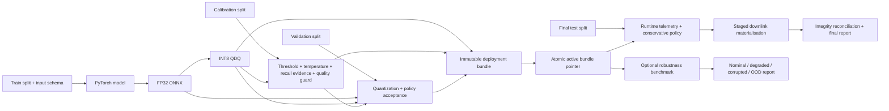

# PhiSat-2 Trustworthy Onboard AI


[](https://github.com/sylvesterkaczmarek/phisat2-trustworthy-onboard-ai/actions/workflows/ci.yml)


[](https://doi.org/10.5281/zenodo.17567181)

A research reference implementation for trustworthy onboard Earth-observation tile triage: deterministic data generation, PyTorch training, ONNX export, static INT8 quantization, statistically explicit calibration, validation-only acceptance gates, conservative data-retention fallback, deployment-bound telemetry, coherent rollback, and deterministic robustness stress testing.

The workflow is inspired by onboard EO processing such as PhiSat-2, but it is independent software and is **not ESA or PhiSat-2 flight code**.

## What the repository demonstrates



Implemented assurance mechanisms include:

- four independent data roles: `train`, `calib`, `validation`, and final `test`;
- a versioned EO input/preprocessing contract with ordered bands, layout, dtype/range, normalization, nodata policy, optional wavelength metadata, and preprocessing version;
- SHA-256 binding of the input contract through dataset, checkpoint, ONNX, calibration, validation, telemetry, and deployment bundle;
- FP32 ONNX export with numerical verification and static QDQ INT8 quantization;
- validation-only quantization gates for classification, event retention, decision agreement, and score drift;
- empirical event recall plus a one-sided exact Clopper-Pearson lower confidence bound;
- a calibrated lightweight input-quality/OOD guard;
- conservative retention on event detection, low confidence, input-quality trigger, input/preprocessing failure, or inference failure;
- deployment-bound telemetry carrying bundle, model, policy, schema, preprocessing, and per-input hashes;
- staged filesystem writes and post-copy hash verification;
- immutable content-addressed deployment bundles with coherent model-policy-schema rollback;
- process watchdog timeout, optional heartbeat monitoring, terminate/kill escalation, and structured restart telemetry;
- deterministic nominal/degraded/corrupted/OOD robustness stress testing;
- automatic run provenance and explicit host timing breakdown.

## Quick start

```bash
git clone https://github.com/sylvesterkaczmarek/phisat2-trustworthy-onboard-ai.git
cd phisat2-trustworthy-onboard-ai/examples/phi2-eo-tile-filter
python -m venv .venv
source .venv/bin/activate
python -m pip install -e ".[dev]"
python scripts/run_demo.py --n 200 --bands 3 --size 64 --epochs 3 --seed 0
```

A seven-band run:

```bash
python scripts/run_demo.py \
  --n 160 --bands 7 --size 32 --epochs 2 --seed 0 \
  --output-root /tmp/phi2-7band
```

Then run the separate post-deployment robustness benchmark:

```bash
python scripts/run_robustness_benchmark.py \
  --output-root /tmp/phi2-7band \
  --samples-per-category 20 \
  --seed 101 \
  --event-prevalences 0.01,0.05,0.10
```

## Reproducible reference environment

`pyproject.toml` is the canonical source of supported dependency ranges. For a concrete pinned reference environment:

```bash
cd examples/phi2-eo-tile-filter
python -m pip install -r requirements-reference.txt
python -m pip install --no-deps -e .
```

Every complete demo automatically writes `reports/run_environment.json`; the robustness run writes `reports/robustness_environment.json`. These artifacts record Git commit/dirty state, Python and platform details, CPU/GPU information where available, package versions, ONNX Runtime provider, run seed/parameters, the reference-requirements SHA-256, and installed-environment fingerprints.

See [docs/reproducibility.md](docs/reproducibility.md) for details.

## Decision policy

A tile is requested for retention when any of the following applies:

1. event probability meets the calibrated event threshold;
2. model confidence is below the configured minimum;
3. the calibrated input-quality guard places the input outside the nominal calibration region;
4. input observation, preprocessing, or inference fails.

Only a confidently classified background tile that passes the input-quality guard is intentionally discarded.

The quality guard uses standardized per-band means/stds plus saturation and spatial-variation features. It is lightweight and deterministic. It is **not** a universal or statistically guaranteed OOD detector.

## Scientific evaluation lifecycle

The final test set is not used to accept a model.

- `train`: parameter fitting only.
- `calib`: INT8 calibration, event-threshold/temperature selection, recall-bound evidence, and input-quality-guard calibration.
- `validation`: FP32 versus INT8 and calibrated-policy acceptance gates.
- `test`: final reporting after the bundle has already passed acceptance and promotion.

The requested recall is a threshold-selection target. The calibration artifact separately reports achieved empirical recall and its one-sided exact Clopper-Pearson lower confidence bound.

## Robustness benchmark

The ordinary square-event generator remains the fast deterministic default. The optional benchmark adds four post-deployment categories:

- **nominal**: the original synthetic distribution;
- **degraded**: noise, illumination shift, per-band gain/offset drift, blur, cloud-like occlusion, spatial shift, and spectral shift;
- **corrupted**: missing/corrupt bands, saturation, and dead-pixel/stripe patterns;
- **OOD**: deterministic checkerboard, sinusoidal, radial, and striped unknown backgrounds with changed spectral structure.

The benchmark reports event retention, background rejection, fallback rate, quality/degradation detection, inference failures, and source-file byte retention separately by category. Its summarizer also requires all records to share one bundle/model/policy/schema identity and re-hashes every benchmark source file before reporting.

These perturbations are simulation tools only. They are **not physically calibrated sensor, atmosphere, optics, cloud, compression, radiation, or spacecraft models**.

## Source-byte and prevalence reporting

The repository reports source-file byte reduction, not spacecraft link bandwidth. Metrics use names such as:

- `source_bytes_total`;
- `source_bytes_retained`;
- `source_bytes_reduction_fraction` / `source_bytes_reduction_pct`;
- `expected_source_bytes_reduction_fraction`.

Reports explicitly set `operational_link_bandwidth_measured: false` because packetisation, framing, FEC, retransmissions, contact geometry, protocol overhead, and adaptive coding/modulation are outside this demonstrator.

The robustness report can calculate expected retention under user-supplied event prevalence scenarios without claiming that the balanced synthetic dataset represents operational prevalence.

## Timing terminology

Runtime telemetry distinguishes:

- input observation/hash latency;
- preprocessing latency;
- input-quality-guard latency;
- ONNX Runtime `session.run` latency;
- probability/policy evaluation latency;
- end-to-end per-tile wall-clock latency.

The standalone `bench_onnxruntime` benchmark and `infer_onnx` utility label ONNX Runtime `session.run` latency explicitly. All timing is labelled as host measurement. Desktop/CI CPU results are **not spacecraft timing, WCET, or hardware qualification evidence**.

## Using real EO data

The synthetic generator is optional infrastructure, not a required model interface. The current reference trainer is intentionally a binary `background` versus `event` demonstration, so a replacement dataset must preserve the repository's current lifecycle and directory contract unless the training code itself is adapted.

For the current implementation:

1. create independent `train`, `calib`, `validation`, and `test` partitions;
2. under each partition, place labelled samples in `background/` and `event/` directories;
3. provide a root `manifest.json` declaring the four split counts/roles and a root `input_schema.json` whose canonical hash matches the manifest;
4. represent supported source data under that explicit schema, replacing generic band IDs with validated sensor-specific band identity/order and, where available, wavelength metadata;
5. define real radiometric range/scaling, normalization, nodata, and preprocessing semantics in the schema;
6. run training, ONNX export, quantization, calibration, validation, bundle, and telemetry stages against those partitions;
7. keep the final test outside model/policy acceptance decisions.

The generic loader deliberately rejects TIFF/GeoTIFF rather than silently reducing scientific imagery through generic 8-bit PIL conversion. Real scientific TIFF/GeoTIFF should use a sensor-aware ingest implementation that preserves band identity, bit depth, scale/offset, nodata, and geospatial metadata.

## Deployment and telemetry integrity

A deployable bundle contains the exact:

- `model.onnx`;
- `policy.json`;
- `input_schema.json`;
- `validation.json`;
- `bundle.json` manifest.

Validation evidence records the SHA-256 of the exact calibration-policy artifact used for validation. Bundle construction rejects evidence generated under a different threshold/confidence/quality-guard policy, even when the model and input schema are otherwise identical.

Promotion verifies the new bundle and the currently active stored bundle before atomically changing the active pointer, so a corrupted active bundle is not silently preserved as the claimed rollback target. Runtime only reports `deployment_bundle_verified: true` after validating the complete local bundle manifest and all component hashes, including validation evidence.

Runtime telemetry identifies the deployment bundle, model, policy, semantic input contract, exact schema file, preprocessing fingerprint, and observed input file. The final summarizer refuses to combine inconsistent final-test/downlink records.

See [docs/assurance.md](docs/assurance.md) for the full assurance model.

## Generated outputs

A main run produces, among other artifacts:

```text
tiles/input_schema.json
calibration.json
logs/test.jsonl
logs/downlink.jsonl
models/bundles/<bundle_id>/
models/deployment_state.json
reports/model_validation.json
reports/metrics.json
reports/summary.md
reports/run_environment.json
```

The optional robustness run additionally produces:

```text
robustness_benchmark/benchmark_manifest.json
robustness_benchmark/<category>/...
robustness_downlink/
logs/robustness_downlink.jsonl
reports/robustness_benchmark.json
reports/robustness_environment.json
```

## CI and local checks

CI tests supported Python 3.11 and 3.12. Python 3.11 exercises the supported dependency ranges; Python 3.12 exercises the pinned reference environment and standalone smoke demo. Both run the complete pytest suite. Ruff is used only for high-confidence syntax/name checks, not a repository-wide style rewrite.

From the repository root:

```bash
make install
make check
make demo
```

For the pinned environment, use `make install-reference`.

## What this repository does not claim

This repository improves experimental hygiene, software integrity, conservative failure behaviour, and reproducible reporting for an onboard-AI demonstrator. It does **not** establish:

- PhiSat-2 performance or sensor equivalence;
- operational EO accuracy;
- physical sensor-fidelity of synthetic perturbations;
- a guaranteed OOD detector;
- flight readiness or hardware qualification;
- radiation tolerance;
- worst-case execution time;
- formal safety;
- authenticated/adversarially tamper-proof telemetry;
- mission-level fault tolerance.

A real flight programme would still require representative mission data, trusted provenance, sensor-specific radiometric ingestion, target-hardware/HIL testing, resource and thermal limits, fault injection, signed update and telemetry handling, platform-specific persistent-storage guarantees, and mission-specific assurance criteria.

## Requirements

- Python 3.11 or 3.12
- PyTorch 2.x
- ONNX and ONNX Runtime for export, quantization, and inference
- no accelerator required for the CI-scale CPU demonstration

Supported dependency ranges are defined in [`examples/phi2-eo-tile-filter/pyproject.toml`](examples/phi2-eo-tile-filter/pyproject.toml). The pinned reference set is [`examples/phi2-eo-tile-filter/requirements-reference.txt`](examples/phi2-eo-tile-filter/requirements-reference.txt).

## Cite this repository

If you use or adapt this repository, please cite:

> Kaczmarek, S. (2025). *PhiSat-2 Trustworthy Onboard AI*. Zenodo. https://doi.org/10.5281/zenodo.17567181

```bibtex
@software{Kaczmarek_2025_PhiSat2_Trustworthy_Onboard_AI,
  author    = {Sylvester Kaczmarek},
  title     = {{PhiSat-2 Trustworthy Onboard AI}},
  year      = {2025},
  publisher = {Zenodo},
  doi       = {10.5281/zenodo.17567181},
  url       = {https://doi.org/10.5281/zenodo.17567181}
}
```

## License

MIT. See [LICENSE](LICENSE).

© **Sylvester Kaczmarek** · [https://www.sylvesterkaczmarek.com](https://www.sylvesterkaczmarek.com)
