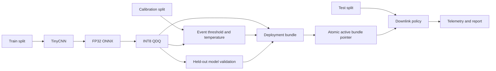

# PhiSat-2 Trustworthy Onboard AI


[](https://github.com/sylvesterkaczmarek/phisat2-trustworthy-onboard-ai/actions/workflows/ci.yml)


[](https://doi.org/10.5281/zenodo.17567181)

Research demonstrator for deterministic Earth-observation tile triage, PyTorch to ONNX deployment, static INT8 quantization, conservative downlink fallback, telemetry, and coherent model-policy deployment rollback. The workflow is inspired by onboard EO processing such as PhiSat-2, but it is independent software and is not ESA or PhiSat-2 flight code.

## At a glance



The design separates model training, policy calibration, validation, deployment, and final evaluation. A deployable configuration is an immutable bundle that cryptographically binds the ONNX model to its calibration policy, preprocessing metadata, and validation evidence.

## What is implemented

- deterministic synthetic EO data generation with independent `train`, `calib`, and `test` splits
- arbitrary multispectral band counts through NumPy tile stacks
- deterministic TinyCNN training with architecture metadata stored in the checkpoint
- PyTorch to FP32 ONNX export with ONNX validation and numerical equivalence check
- static QDQ INT8 quantization with calibration data kept separate from final test data
- held-out FP32 versus INT8 accuracy and prediction-agreement regression checks
- calibrated event threshold targeting a requested event recall
- optional deterministic temperature scaling on the calibration split
- conservative fallback that downlinks low-confidence tiles and inference failures
- deployment bundles containing model, policy, preprocessing/input schema, validation evidence, and hashes
- content-addressed immutable bundle storage with atomic active/previous deployment state
- exact validation-report-to-model hash binding before promotion
- per-tile input and model SHA-256 telemetry
- exact byte-level bandwidth accounting
- coherent model-policy rollback
- bounded watchdog without `shell=True`
- CI that runs the full multispectral pipeline

## Decision policy

A tile is retained when it is predicted to contain the target event, when confidence is below the configured minimum, or when preprocessing/inference fails. Only confidently classified background data are discarded.

This is intentionally conservative about science-data loss. See [docs/assurance.md](docs/assurance.md).

## Quick start

```bash
git clone https://github.com/sylvesterkaczmarek/phisat2-trustworthy-onboard-ai.git
cd phisat2-trustworthy-onboard-ai/examples/phi2-eo-tile-filter
python -m venv .venv
source .venv/bin/activate
python -m pip install -e ".[dev]"
python scripts/run_demo.py --n 200 --bands 3 --size 64 --epochs 3 --seed 0
```

A multispectral run uses the same pipeline:

```bash
python scripts/run_demo.py --n 160 --bands 7 --size 32 --epochs 2 --seed 0 --output-root /tmp/phi2-7band
```

The synthetic generator uses `.npy` arrays so band counts greater than RGB are preserved without pretending that PNG is a multispectral format.

## Generated outputs

A complete run produces:

```text
calibration.json
logs/test.jsonl
logs/downlink.jsonl
models/candidate_bundle/
models/bundles/<bundle_id>/
models/deployment_state.json
reports/model_validation.json
reports/metrics.json
reports/summary.md
```

Each stored bundle contains `model.onnx`, `policy.json`, `input_schema.json`, `validation.json`, and `bundle.json`. The deployment-state file names the active and previous bundle by content-derived bundle ID.

The report uses held-out test telemetry for precision, recall, AUC, latency, fallback count, event capture, and exact byte-level bandwidth savings. Calibration metrics are kept separate from test metrics.

## Validation gates

The pipeline fails rather than silently continuing when:

- the checkpoint architecture metadata do not match the exporter
- PyTorch and FP32 ONNX outputs exceed the configured numerical tolerance
- ONNX structural validation fails
- the quantized artifact lacks the expected QDQ operators
- held-out INT8 accuracy degrades beyond the allowed threshold
- FP32 and INT8 prediction agreement falls below the required level
- a calibration file belongs to a different model hash or input shape
- the validation report does not cover the exact candidate INT8 model
- any bundle component is missing or has a mismatched SHA-256
- the bundle manifest or deployment state is inconsistent

The active deployment is changed only after validation, calibration, bundle construction, and bundle verification have completed successfully.

## Deployment bundle handling

Build a candidate bundle only after validation and calibration have succeeded:

```bash
python ../../assurance/model_store.py build \
  --model models/tinycnn_int8.onnx \
  --policy calibration.json \
  --validation reports/model_validation.json \
  --out models/candidate_bundle
```

Promote the complete bundle into the immutable store:

```bash
python ../../assurance/model_store.py promote \
  --candidate-bundle models/candidate_bundle \
  --store models/bundles \
  --state models/deployment_state.json
```

Resolve and verify the active deployment:

```bash
python ../../assurance/model_store.py resolve \
  --store models/bundles \
  --state models/deployment_state.json
```

Rollback swaps the active and previous bundle identifiers, so the model, policy, input schema, and validation evidence move together:

```bash
bash ../../assurance/rollback.sh
```

## Watchdog

The watchdog takes an explicit argv list and does not execute a shell command string. For an active deployment, resolve the bundle first and pass its `model` path to the inference command.

```bash
python ../../assurance/watchdog.py --restarts 3 --sleep-s 2 --cwd . -- \
  python -m phi2_tile_filter.infer_onnx --onnx /path/to/resolved/model.onnx --data tiles/test
```

## Data interface

The demonstration accepts image files for 1, 3, or 4 bands and `.npy` arrays for arbitrary multispectral input. Floating-point NumPy tiles must already be scaled to `[0, 1]`. Real mission data should have a documented preprocessing and radiometric normalization pipeline rather than relying on this toy loader.

The deployment bundle records the current demo input contract, including layout, bands, spatial size, dtype, value range, and preprocessing identifier. This is integrity metadata for the demonstrator, not a substitute for a mission-specific radiometric pipeline.

## Reproducibility

See [docs/reproducibility.md](docs/reproducibility.md). Training seeds Python, NumPy, PyTorch, and DataLoader shuffling. CI performs the end-to-end pipeline using a seven-band synthetic dataset so multispectral support and deployment-bundle handling cannot regress unnoticed.

## What this repository does not claim

This repository is a software and assurance demonstrator. The synthetic benchmark is deliberately simple. It does not establish PhiSat-2 performance, flight readiness, radiation tolerance, worst-case execution time, hardware qualification, operational EO accuracy, formal safety, or mission-level fault tolerance.

The watchdog and deployment helpers are process-level examples rather than flight-qualified FDIR. Real onboard deployment would also require representative sensor data, hardware-in-the-loop validation, resource and thermal limits, platform-specific persistent storage guarantees, signed model/update handling, fault injection, and mission-specific acceptance criteria.

## Repository layout

```text
.
├── .github/workflows/ci.yml
├── assurance/
│   ├── model_store.py
│   ├── rollback.sh
│   ├── summarize.py
│   ├── telemetry_log.py
│   └── watchdog.py
├── docs/
│   ├── assurance.md
│   └── reproducibility.md
├── examples/phi2-eo-tile-filter/
│   ├── data/
│   ├── scripts/run_demo.py
│   ├── src/phi2_tile_filter/
│   ├── tests/
│   ├── pyproject.toml
│   └── requirements.txt
├── CITATION.cff
├── LICENSE
├── Makefile
└── README.md
```

## Requirements

- Python 3.11 or newer
- PyTorch 2.x
- ONNX and ONNX Runtime for export, quantization, and inference
- no accelerator is required for the CI-scale CPU demonstration

Exact dependency bounds are defined in [`examples/phi2-eo-tile-filter/pyproject.toml`](examples/phi2-eo-tile-filter/pyproject.toml) and mirrored in [`requirements.txt`](examples/phi2-eo-tile-filter/requirements.txt).

## Cite this repository

If you use or adapt this repository, please cite:

> Kaczmarek, S. (2025). *PhiSat-2 Trustworthy Onboard AI*. Zenodo. https://doi.org/10.5281/zenodo.17567181

```bibtex
@software{Kaczmarek_2025_PhiSat2_Trustworthy_Onboard_AI,
  author    = {Sylvester Kaczmarek},
  title     = {{PhiSat-2 Trustworthy Onboard AI}},
  year      = {2025},
  publisher = {Zenodo},
  doi       = {10.5281/zenodo.17567181},
  url       = {https://doi.org/10.5281/zenodo.17567181}
}
```

## License

MIT. See [LICENSE](LICENSE).

© **Sylvester Kaczmarek** · [https://www.sylvesterkaczmarek.com](https://www.sylvesterkaczmarek.com)
